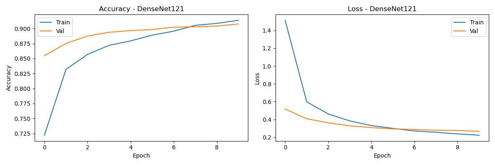

# Multi-Class Lung Disease Classification from Chest X-Rays

This repository contains a deep learning project for the multi-class classification of lung diseases—specifically **Pneumonia**, **COVID-19**, and **Tuberculosis**—from chest X-ray images. The project implements and compares two Convolutional Neural Network (CNN) architectures: a custom-built CNN and a state-of-the-art DenseNet121 model.

---

## Model Performance Comparison

The primary objective was to build an effective classifier for the three lung conditions and compare the performance of a custom architecture against a pre-trained one. After training, the **DenseNet121 model achieved superior accuracy and generalization**. This is largely due to the power of **transfer learning**, which allowed the model to leverage a vast set of pre-learned features from the ImageNet dataset, making it highly effective for this medical imaging task.

A direct comparison of their performance is detailed below.

### **Custom CNN Results**

| Performance Curve                                                  | Confusion Matrix                                            |
| :-----------------------------------------------------------------: | :----------------------------------------------------------: |
|  |     |

### **DenseNet121 Results**

| Performance Curve                                                     | Confusion Matrix                                               |
| :--------------------------------------------------------------------: | :-------------------------------------------------------------: |
|  |       |

---

## Project Workflow

The project is structured as a modular pipeline, with dedicated scripts for processing, training, and evaluation, and a separate directory for model definitions.

1.  **Data Preprocessing (`src/processing.py`):**
    * Images from the four classes (Normal, Pneumonia, COVID-19, Tuberculosis) are loaded and resized.
    * Data augmentation techniques are applied to the training set to increase its diversity and combat overfitting.

2.  **Model Architectures (`models/`):**
    * **Custom CNN (`models/custom_CNN_Model.py`):** A sequential CNN built from scratch with several convolutional and dense layers.
    * **DenseNet121 (`models/densenet121_Model.py`):** This model implements **transfer learning**. A pre-trained DenseNet121 is loaded with its ImageNet weights, and its classification head is replaced with new, trainable layers tailored for this 4-class task.

3.  **Training & Evaluation (`src/`):**
    * **Training (`src/train.py`):** Both models are trained using the Adam optimizer and categorical cross-entropy loss function.
    * **Testing (`src/test_results.py`):** The trained models are evaluated on the unseen test set to generate performance metrics, including the plots and confusion matrices shown above.

---

## Dataset

The dataset is a composition of chest X-ray images for four classes: Normal, Pneumonia, COVID-19, and Tuberculosis.

**Note:** The dataset is too large to be hosted on GitHub. It can be downloaded from the following public link:

**[Download the Chest X-Ray Dataset (Google Drive)](https://drive.google.com/drive/folders/1j0352oNP12JrKCFrcfq62B6NYdq3OeoQ?usp=drive_link)**

After downloading, please place the image folders inside a `data/` directory in the root of the project.

---

## Tech Stack

* **Language**: Python
* **Framework**: TensorFlow, Keras
* **Core Libraries**: Scikit-learn, Pandas, OpenCV, Matplotlib

---

## How to Run the Pipeline

1.  **Clone the repository and set up the environment:**
    ```bash
    git clone https://github.com/Derrick-M99/lung-disease-classification-cnn.git
    pip install -r requirements.txt
    ```

2.  **Download and place the dataset** into a `data/` folder as described above.

3.  **Run the data splitting script** to create train/validation/test sets:
    ```bash
    python src/data_split.py
    ```

4.  **Train a model.** To train the DenseNet121 model, for example:
    ```bash
    python src/train.py --model densenet121
    ```
    *(Use `--model custom_cnn` to train the custom model)*

5.  **Evaluate the trained model** on the test set:
    ```bash
    python src/test_Results.py --model densenet121
    ```

---

## License

This project is licensed under the **MIT License**.
